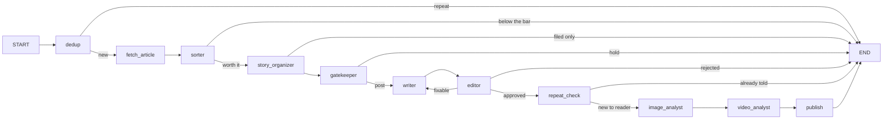

# AI Flow — a Telegram channel that runs itself

**@ai_flow_daily** posts AI news that regular people can use: freelancers, business
owners, designers, video makers, students. Every post has to make sense to a 12-year-old.
Nobody approves posts by hand. A pipeline of small steps reads the sources, throws out
repeats and noise, writes the post, has a second AI check it against the source, and
sends it. A web dashboard shows everything it did and why.

Runs on the VPS as two services: **`aif-channel`** (the channel) and
**`aif-dashboard-api`** (the API the dashboard website reads).

> Market One (@market_one_news), the markets channel that used to run from this same
> code, was paused on 2026-10-07. Everything needed to bring it back is in
> `archive/market-one/` (start with `RESTORE.md`) and the git tag `market-one-final`.

---

## The flow

Two loops run inside one program. The **collect loop** stores new items every 10
minutes. The **publish loop** runs every 2 minutes and sends each queued item through
this LangGraph graph (`pipeline/graph.py`):



| Step | File | What it decides |
|---|---|---|
| dedup | `nodes/dedup.py`, `nodes/judge.py` | Have we seen this? Five checks, cheapest first; the last one is an AI reading both texts. |
| fetch_article | `nodes/article.py` | Reads the full page *before* the sorter (feeds often give one line). Plain request, then a stealth browser, then a reader service. Collects pictures, video players and the product link. For a tweet it reads up to 3 pages the tweet links to instead (see below). |
| sorter | `nodes/sorter.py` + `prompts/rubric.md` | Is it worth posting? Kind (launch, tool, skill, resource), who can use it today, usefulness 1-5. 4+ goes on. "Nobody can use it" caps at 3 in code. |
| story_organizer | `nodes/stories.py` | Which running story does it join? One product or release = one story. |
| gatekeeper | `nodes/stories.py` | Has the story moved? Post, or hold the item as fuel for the story's next post. |
| writer | `nodes/writer.py` + `prompts/writer.md`, `prompts/persona.md` | Writes the post in AI Flow's voice. |
| editor | `nodes/editor.py` + `prompts/editor.md` | Checks the post against its source. Can only reject by naming a rule. A fixable rejection goes back to the writer once. **Fails closed.** |
| repeat_check | `nodes/echo.py` | Does the finished post tell the reader anything a post of the last 60 days did not? |
| image / video analyst | `nodes/image_analyst.py`, `nodes/video_analyst.py` + `prompts/*_rubric.md` | Picks the one picture or clip that shows what the post says, or none. |
| publish | `nodes/publisher.py` | Fills in the product link, adds the signature, sends with the chosen media. |

`pipeline/stations.py` holds the thin graph-node wrappers; the real work is in `nodes/`.

---

## Folder map

```
main.py           start the channel, and one-off commands (check, stats, …)
config.py         every setting: sources, limits, models, rules
schema.sql        the database layout
prompts/          rubric, persona, writer, editor, image and video rubrics (plain text)
pipeline/         graph.py (the LangGraph wiring) and stations.py (what each step does)
nodes/            one file per job
utils/            database, OpenRouter, Telegram, embeddings, logging
dashboard/        backend/ (FastAPI on the VPS) and frontend/ (Next.js on Vercel)
deploy/           systemd units, log rotation, install.sh
tools/            rehearse, stats, source and dedup checks, memory backfill
tests/            run without network; every model call is faked
docs/             past specs of AI Flow
archive/          Market One, paused
data/, logs/      the database and logs (not in git)
```

---

## Setup (on a fresh machine)

```bash
cp .env.example .env && nano .env      # bot token, channel, OpenRouter key, signature, dashboard token
python3 -m pip install --user --break-system-packages -r requirements.txt
python3 main.py check                  # are the settings complete?
python3 main.py initdb                 # create the database
python3 tools/check_sources.py         # do all the feeds work?
sudo bash deploy/install.sh            # both services + log rotation
```

The dashboard API needs its own Python environment once:
`cd dashboard/backend && python3 -m venv venv && venv/bin/pip install -r requirements.txt`.

**Rehearse before changing anything that affects what gets posted.** Posts go straight to
the live channel; there is no approval step.

```bash
python3 main.py collect --once
python3 tools/rehearse.py --limit 25   # runs real items through the graph, sends nothing (~5 cents)
```

---

## Everyday use

```bash
sudo systemctl status aif-channel           # is it running?
tail -f logs/aif-channel.log                # what is it doing right now?
python3 main.py stats                       # how is it doing?
python3 tools/stats.py --declines           # what did the editor reject, and was it right?
python3 tools/stats.py --dropped            # what did the sorter refuse?
python3 tools/check_sources.py              # are the feeds alive?
python3 tools/check_dedup.py                # is the meaning check actually running?
```

**Change how posts read:** edit `prompts/writer.md` or `prompts/persona.md`, rehearse,
then `sudo systemctl restart aif-channel`.
**Change what gets posted:** edit `prompts/rubric.md`. If you add a topic, also add it to
`TOPICS` in `config.py` (the model physically cannot answer with a topic the list lacks).
**Add a feed:** add it to `SOURCES` in `config.py`, run `tools/check_sources.py`, restart.
**Add an X account:** it needs two edits: `X_ACCOUNTS` in `config.py` and the tweet relay's
`/home/nikita/systems/infra/tweet-relay/accounts.txt` (then `sudo systemctl restart tweet-relay`
and `aif-channel`). A test fails if the two lists differ. Followed now: openai, googledeepmind,
claudeai, claudedevs, testingcatalog, btibor91.

### Tweets

A tweet is a trigger, not the whole story. The relay sends the full text of long posts, the
real address and X's preview of every link, and the post it quotes or reposts (retweets are
included). AI Flow stores one source with labelled parts: `POST by @account`, then
`QUOTED POST by @other` or `@account REPOSTED this post by @other`, then `LINKED PAGE 1-3`
(read with the same plain → browser → reader chain; X's preview stands in for a page that
can't be read). Links back to X are skipped. The first outside link becomes the post's link,
and the pictures and clips of the tweet, the shared post and the linked pages are all
candidates for the analysts. `prompts/writer.md` and `prompts/editor.md` explain the labels.

### Changing a model

Every model is a line in `config.py`, overridable in `.env`. Before switching one:
- **Test it on real items with a raw call, not through `utils/openrouter.py`**: that helper
  retries and falls back on a bad answer, which hides exactly the failures you are testing for.
- **Schema failures come from the model × provider pair.** The same model id answered 5/5 on
  some OpenRouter providers and 0/5 on others, and every one of them claimed schema support.
  Prefer models served only by their own lab or the big clouds (Google, OpenAI, Anthropic,
  Mistral), and check `curl https://openrouter.ai/api/v1/models/<id>/endpoints`.
- **The editor must stay a different lab from the writer**, and must not move without a test
  set containing known falsehoods. It fails closed, and its job is catching lies.
- Reasoning models spend their thinking against `max_tokens`; a budget that looks generous
  can still cut the answer off.

---

## How the important steps think

**Dedup.** Same link, same headline, nearly the same wording, then embeddings shortlist
anything about the same subject (≥ 0.72) and an AI judge rules "same event", "a
continuation" or "different". Embeddings alone never decide: on hand-labelled pairs,
real duplicates scored 0.738-0.993 and genuinely different items 0.785-0.900. The ranges
overlap, so no cutoff works. Items more than 12 hours apart are never compared. A repeat
worded differently is filed with its story as fuel rather than deleted. Fails **open**: a
duplicate is a small embarrassment, a silent channel is worse.

**Stories.** Items don't become posts; they join a story, and a story posts when it has
moved. Placement is one model call shown every open story plus related closed ones from
the last 60 days; a closed story can reopen. A placement failure leaves the item queued,
because guessing opens a duplicate story. `nodes/coverage.py` decides in plain code which
waiting items a post really covered, by the details only that item supplied. A model shown
six items reports all six as used.

**Repeat check (the exit).** Compares the finished post with every published post of the
last 60 days that looks related (embeddings ≥ 0.60, cached per post) and asks the reader's
question: "does this tell someone who saw those posts anything new?". Every "send" must quote
the new information. Nothing routes around it, and if it can't run, the post waits.

**Editor.** Checks FACTS, not wording: the writer is told to rewrite simply, so "lightweight"
→ "small" or "images" → "pictures" must pass, while an invented "free", a product the source never
names, a changed date or a changed "what it does" must not. Before changing its prompt or model run
`python3 tools/check_editor.py` (22 cases: faithful rewrites to approve, planted and real falsehoods
to reject, in `tests/fixtures/editor_cases.json`). Can only reject by naming a rule from a fixed list
(plus JARGON on this channel). Every decision is logged; rejecting more than half of the last 20 sends an
alert. On a rewrite it is shown its own earlier reason, so it can't ask for the opposite.

**Writer.** No emoji at all, only the "•" bullet. Bold first line, bold key words, the link
last. It never copies a link: it writes `LINK` and the publisher fills in the product
address. Every link in a post loses its `utm_` tracking parameters (`textclean.strip_utm`). Code guarantees what the prompt asks: a one-line source stays one line unless the
extra lines carry a figure from the source, and a post that opens like a recent one is
written again once.

**Too thin to post.** A source with under 250 characters of real text and no page read is capped at
3 in code (`sorter.THIN_SOURCE_CHARS`): a headline-only post tells the reader nothing. A one-line
source that is posted keeps any body sentence built from the source's own words.

**Roundups.** From a daily brief listing many items the writer picks the single most important one.

**Daily limits.** Guides ("resource") and skill packs ("skill") are capped at 2 a day, 3 hours
apart. One that passes but hits the cap waits in the reserve (`nodes/reserve.py`), and the best
waiting one is posted when a slot frees up.

---

## Models and cost

| Step | Model (OpenRouter) |
|---|---|
| Sorter, dedup judge, story placement and gate, image and video analysts | `google/gemini-2.5-flash` |
| Writer | `deepseek/deepseek-v3.2` |
| Editor | `anthropic/claude-haiku-4.5`, fallback `google/gemini-3.5-flash-lite` (chosen 2026-10-07 with `tools/check_editor.py`) |
| Repeat check | `mistralai/mistral-medium-3.1` |
| Embeddings | `openai/text-embedding-3-small` |

About **$9-10 a month** at ~120 items a day (estimated from two days of real volume on
2026-10-06). The biggest share is story placement, then the sorter and the video analyst.
On 2026-10-06 Market One measured `google/gemini-3.5-flash-lite` (sorter) and
`openai/gpt-6-luna` (writer) as better and no dearer; they have not been tested on AI Flow.

---

## The dashboard

A password-protected website (Next.js on Vercel, project **m1-dashboard**, domain
**m1.simple-flow.co**) with tabs for posts, stories, stats, the graph and every step's
model and prompt. It reads the read-only API in `dashboard/backend/`, which nginx on the
VPS exposes at `/api/dashboard/v1`.

- **Deploy the website by `git push` to main.** Vercel builds `dashboard/frontend`.
  Never run the `vercel` CLI by hand; it once created a stray second project.
- **Vercel settings it needs:** `NEXT_PUBLIC_API_URL` (the VPS address + `/api/dashboard/v1`),
  `BACKEND_ORIGIN`, `DASHBOARD_TOKEN` (must equal `DASHBOARD_TOKEN` in the VPS `.env`),
  `DASHBOARD_PASSWORD` and `SESSION_SECRET` (the login).
- **The API token lives only in `.env`.** It used to be written into the committed service
  file and leaked to GitHub; it was rotated on 2026-10-07.
- Endpoints (all GET, under `/api/v1`, Bearer token): `posts`, `stories`, `stats`, `graph`,
  `nodes`, `overrides`; POST `actions/force` and `actions/should-not-have-posted` are the
  only writes. Run it locally with
  `cd dashboard/backend && DASHBOARD_TOKEN=x venv/bin/uvicorn main:app --port 8000`.

---

## Troubleshooting

| Problem | Likely cause |
|---|---|
| Nothing is being posted | `python3 main.py stats`: is anything queued? Is the editor rejecting everything? |
| "Chat not found" / "Not enough rights" | `CHANNEL_ID` wrong, or the bot isn't an admin with Post Messages |
| A feed stopped working | `tools/check_sources.py`. You get an alert after 5 straight failures |
| Duplicates getting through | First `tools/check_dedup.py`: are checks 4-5 running at all? Then read the judge's reasons in `tools/stats.py` |
| Posts sound wrong | `prompts/writer.md` / `prompts/persona.md`, rehearse with `tools/rehearse.py` |
| Good items not posted | `tools/stats.py --dropped`: the sorter (`prompts/rubric.md`) or the gate |
| Dashboard says "API offline" | `sudo systemctl status aif-dashboard-api`; then check `DASHBOARD_TOKEN` matches in `.env` and Vercel |
| Videos fail to download | yt-dlp is updated every Monday by cron (`logs/yt-dlp-update.log`) |

## Tests

```bash
/usr/bin/python3 tests/test_ai_channel.py
/usr/bin/python3 tests/test_media.py
/usr/bin/python3 -m unittest tests/test_reader_memory.py
```
