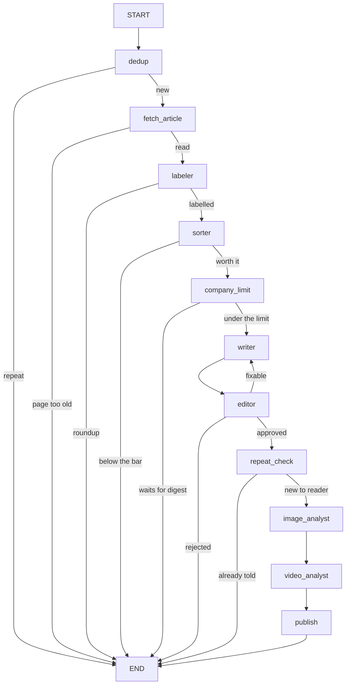

# AI Flow — a Telegram channel that runs itself

**@ai_flow_daily** posts AI news that regular people can use: freelancers, business
owners, designers, video makers, students. Every post has to make sense to a 12-year-old.
Nobody approves posts by hand. A pipeline of small steps reads the sources, throws out
repeats and noise, writes the post, has a second AI check it against the source, and
sends it. A web dashboard shows everything it did and why.

Runs on the VPS as two services: **`aif-channel`** (the channel) and
**`aif-dashboard-api`** (the API the dashboard website reads).

> Market One (@market_one_news), the markets channel that used to run from this same
> code, was paused on 2026-10-07. Everything needed to bring it back is in
> `archive/market-one/` (start with `RESTORE.md`) and the git tag `market-one-final`.

---

## The flow

Two loops run inside one program. The **collect loop** stores new items every 10
minutes. The **publish loop** runs every 2 minutes and sends each queued item through
this LangGraph graph (`pipeline/graph.py`):



The arrow labels are the words the route functions in `pipeline/stations.py` return. The
dashboard's Graph tab draws the same graph from the running code (LangGraph's own
`draw_mermaid`, saved to the database at every start).

| Step | File | What it decides |
|---|---|---|
| dedup | `nodes/dedup.py`, `nodes/judge.py` | Have we seen this? Five checks, cheapest first; the last one is an AI reading both texts. |
| fetch_article | `nodes/article.py` | Reads the full page *before* anything is judged (feeds often give one line). Plain request, then a stealth browser, then a reader service. Collects pictures, video players and the product link. A feed article whose own page is dated older than `ARTICLE_MAX_AGE_HOURS` (+1 day) is dropped as `skipped_stale`: aggregators like Future Tools date an item when *they* list it. For a tweet it reads up to 3 pages the tweet links to instead (see below). |
| labeler | `nodes/labeler.py` + `prompts/labeler.md` | What kind is it, and which company made it? Both from fixed lists in `config.py` (`KINDS`, `COMPANIES`); anything off the list is stored as "other". A **roundup** stops here. A cheap model. |
| sorter | `nodes/sorter.py` + `prompts/rubric.md` | Is it worth posting? Who can use it today, usefulness 1-5, given the labels. 4+ goes on. "Nobody can use it" caps at 3 in code. |
| company_limit | `nodes/company_digest.py` | Has this company had its 2 posts today? If so the item waits for the company's evening digest. A 5/5 always goes. |
| writer | `nodes/writer.py` + `prompts/writer.md`, `prompts/persona.md` | Writes the post in AI Flow's voice. |
| editor | `nodes/editor.py` + `prompts/editor.md` | Checks the post against its source. Can only reject by naming a rule. A fixable rejection goes back to the writer, up to 3 times. **Fails closed.** |
| repeat_check | `nodes/echo.py` | Does the finished post tell the reader anything a post of the last 60 days did not? |
| image / video analyst | `nodes/image_analyst.py`, `nodes/video_analyst.py` + `prompts/*_rubric.md` | Picks the one picture or clip that shows what the post says, or none. |
| publish | `nodes/publisher.py`, `nodes/link_finder.py` | Fills in the product link (never a link to X), adds the signature, sends with the chosen media. |

`pipeline/stations.py` holds the thin graph-node wrappers; the real work is in `nodes/`.

---

## Folder map

```
main.py           start the channel, and one-off commands (check, stats, …)
config.py         every setting: sources, limits, models, rules
schema.sql        the database layout
prompts/          rubric, persona, writer, editor, image and video rubrics (plain text)
pipeline/         graph.py (the LangGraph wiring) and stations.py (what each step does)
nodes/            one file per job
utils/            database, OpenRouter, Telegram, embeddings, logging
dashboard/        backend/ (FastAPI on the VPS) and frontend/ (Next.js on Vercel)
deploy/           systemd units, log rotation, install.sh
tools/            rehearse, stats, source and dedup checks, memory backfill
tests/            run without network; every model call is faked
docs/             past specs of AI Flow
archive/          Market One, paused
data/, logs/      the database and logs (not in git)
```

---

## Setup (on a fresh machine)

```bash
cp .env.example .env && nano .env      # bot token, channel, OpenRouter key, signature, dashboard token
python3 -m pip install --user --break-system-packages -r requirements.txt
python3 main.py check                  # are the settings complete?
python3 main.py initdb                 # create the database
python3 tools/check_sources.py         # do all the feeds work?
sudo bash deploy/install.sh            # both services + log rotation
```

The dashboard API needs its own Python environment once:
`cd dashboard/backend && python3 -m venv venv && venv/bin/pip install -r requirements.txt`.

**Rehearse before changing anything that affects what gets posted.** Posts go straight to
the live channel; there is no approval step.

```bash
python3 main.py collect --once
python3 tools/rehearse.py --limit 25   # runs real items through the graph, sends nothing (~5 cents)
```

---

## Everyday use

```bash
sudo systemctl status aif-channel           # is it running?
tail -f logs/aif-channel.log                # what is it doing right now?
python3 main.py stats                       # how is it doing?
python3 tools/stats.py --declines           # what did the editor reject, and was it right?
python3 tools/stats.py --dropped            # what did the sorter refuse?
python3 tools/check_sources.py              # are the feeds alive?
python3 tools/check_dedup.py                # is the meaning check actually running?
```

**Change how posts read:** edit `prompts/writer.md` or `prompts/persona.md`, rehearse,
then `sudo systemctl restart aif-channel`.
**Change what gets posted:** edit `prompts/rubric.md`. If you add a topic, also add it to
`TOPICS` in `config.py` (the model physically cannot answer with a topic the list lacks).
**Add a feed:** add it to `SOURCES` in `config.py`, run `tools/check_sources.py`, restart.
**Add an X account:** it needs two edits: `X_ACCOUNTS` in `config.py` and the tweet relay's
`/home/nikita/systems/infra/tweet-relay/accounts.txt` (then `sudo systemctl restart tweet-relay`
and `aif-channel`). A test fails if the two lists differ. Followed now: openai, googledeepmind,
claudeai, claudedevs, testingcatalog, btibor91.

### Tweets

A tweet is a trigger, not the whole story. The relay sends the full text of long posts, the
real address and X's preview of every link, and the post it quotes or reposts (retweets are
included). AI Flow stores one source with labelled parts: `POST by @account`, then
`QUOTED POST by @other` or `@account REPOSTED this post by @other`, then `LINKED PAGE 1-3`
(read with the same plain → browser → reader chain; X's preview stands in for a page that
can't be read). Links back to X are skipped. The first outside link becomes the post's link.
The pictures and clips of the tweet, the shared post and the linked pages are all
candidates for the analysts. `prompts/writer.md` and `prompts/editor.md` explain the labels.

**A post never links to X.** "Try it here" opening a news account's tweet promoted them and
misled the reader (Odyssey-3, 2026-10-08). Two layers:
- `publisher.compose` refuses any X/Twitter address in code; with nothing else to link, the
  whole link line is dropped.
- When a tweet has no outside link, `nodes/link_finder.py` runs just before sending (called
  from `publish_node`). **Only a new product someone can try gets a link**; an announcement,
  feature update or research news is just reported, with no link line, because the post
  already says what the article would (2026-10-09). It sends Gemini one request with
  OpenRouter's **web plugin** switched on (`web_search=True`): OpenRouter searches the web
  first (Exa, 5 results, ~2 cents); Gemini answers with the try/use/download page or NONE.
  Code then checks the page loads, is not on X and is not dated more than
  `LINK_MAX_AGE_DAYS` (14) ago. If it is an announcement page (`/blog/`, `/news/`,
  `/index/`…), only a "try it" link on it (`experience.`, `app.`, "Try", "Demo"…) is used;
  otherwise there is no link. (A fresh Managed Agents tweet once got the May 28 dynamic
  workflows blog post as its link, 2026-10-09.)

### Fixing a post that already went out

`python3 tools/edit_post.py ITEM_ID --html new_post.html [--link URL | --no-link] [--dry-run]`
edits the message in the channel (caption or text) and saves the new version to the database,
so the dashboard and the repeat check see it. Run the new text past the editor first. Used on
2026-10-10 for seven posts with repeats, an unknown maker, or a wrong link.

### Changing a model

Every model is a line in `config.py`, overridable in `.env`. Before switching one:
- **Test it on real items with a raw call, not through `utils/openrouter.py`**: that helper
  retries and falls back on a bad answer, which hides exactly the failures you are testing for.
- **Schema failures come from the model × provider pair.** The same model id answered 5/5 on
  some OpenRouter providers and 0/5 on others, and every one of them claimed schema support.
  Prefer models served only by their own lab or the big clouds (Google, OpenAI, Anthropic,
  Mistral), and check `curl https://openrouter.ai/api/v1/models/<id>/endpoints`.
- **The editor must stay a different lab from the writer**, and must not move without a test
  set containing known falsehoods. It fails closed, and its job is catching lies.
- Reasoning models spend their thinking against `max_tokens`; a budget that looks generous
  can still cut the answer off.

---

## How the important steps think

**Dedup.** Same link, same headline, nearly the same wording, then embeddings shortlist
anything about the same subject (≥ 0.72) and an AI judge rules "same event", "a
continuation" or "different". Embeddings alone never decide: on hand-labelled pairs,
real duplicates scored 0.738-0.993 and genuinely different items 0.785-0.900. The ranges
overlap, so no cutoff works. The embeddings and the judge look back **7 days**
(`DUPLICATE_MAX_GAP_HOURS`, `COSINE_WINDOW_HOURS`; was 12 hours for Market One's recurring
market figures); the wording checks look back 24 hours, because "DAILY AI BRIEF — Oct 7" and
"— Oct 8" read 95% alike. A "same event" repeat is dropped when the earlier item went out, is
on its way or waits for a digest; when the earlier one was turned down, the new one is let
through. Fails **open**: a duplicate is a small embarrassment, a silent channel is worse.

**Labels.** Nine kinds — `new_product` (a new standalone product from a listed company),
`new_model`, `feature` (new inside a product you already have), `pricing`, `tool` (anything
new from a maker not on the list), `skill` (everything from skills.sh is one, decided in code),
`guide`, `roundup`, `other` — and the company that *made* it, not who posted about it. The
kind is stored in `items.topic`, the company in `items.company`. Before changing the prompt
or model run `python3 tools/check_labels.py` (75 hand-labelled items in
`tests/fixtures/label_cases.json`). On 2026-10-09 gemini-3.5-flash-lite scored 60-61/61 on
the cases the prompt was tuned on and 13/15 kinds, 15/15 companies on 15 it had never seen.

**Company limit and the digest.** At most `COMPANY_DAILY_LIMIT` (2) posts per company per UTC
day. A third item waits as `waiting_digest`; from `DIGEST_HOUR_UTC` (18:00 UTC) each company's
waiting items go out once as one post with a "•" line per item (`company_digest.build_source`
+ a COMPANY DIGEST brief to the writer); a single waiting item goes out as a normal post.
Each company's digest is marked done in the `meta` table *before* it runs, so a crash cannot
send two. Waiting more than `DIGEST_MAX_WAIT_HOURS` (30) expires an item. 5/5 items and the
company "other" are never held. A digest has no link line.

**Stories are off.** Market One's story mechanism (one thread per running event, a gate that
posts only when it moved) made no threads on AI Flow and mostly re-filed what dedup caught.
`config.STORIES = False` takes the story stations out of the graph; the code stays until
about 2026-10-16. A copy and how it worked: `archive/market-one/code/stories/README.md`.

**Repeat check (the exit).** Compares the finished post with every published post of the
last 60 days that looks related (embeddings ≥ 0.60, cached per post) and asks the reader's
question: "does this tell someone who saw those posts anything new?". Every "send" must quote
the new information. Nothing routes around it, and if it can't run, the post waits.

**Editor.** Checks FACTS, not wording: the writer is told to rewrite simply, so "lightweight"
→ "small" or "images" → "pictures" must pass, while an invented "free", a product the source never
names, a changed date or a changed "what it does" must not. Before changing its prompt or model run
`python3 tools/check_editor.py` (22 cases: faithful rewrites to approve, planted and real falsehoods
to reject, in `tests/fixtures/editor_cases.json`). Can only reject by naming a rule from a fixed list
(plus JARGON on this channel). Every decision is logged; rejecting more than half of the last 20 sends an
alert. A fixable rejection goes back to the writer up to 3 times (`MAX_REWRITES`). The writer
edits its rejected draft rather than starting over, and both the writer and the editor see every
earlier request, so a fix is not undone and the editor can't ask for the opposite. Was 1 rewrite
from scratch: 13 of 17 final rejections (2026-10-04..07) were a second draft with one new small
fault; replayed with the new loop, 17 of 17 passed.

**Writer.** No emoji at all, only the "•" bullet. Bold first line, bold key words, the link
last. It never copies a link: it writes `LINK` and the publisher fills in the product
address. Every link in a post loses its `utm_` tracking parameters (`textclean.strip_utm`). Code guarantees what the prompt asks: a one-line source stays one line unless the
extra lines carry a figure from the source, and a post that opens like a recent one is
written again once.

**Every line says something new** (2026-10-10). The body never restates the first line, an
unknown maker (a username, an individual nobody in AI knows) is not named, and nothing true of
every item of its kind is said (a skill being free or needing no account). The editor rejects
these as `REPEATS` and `FILLER`, both fixable, so the writer cuts them on the rewrite.

**An aggregator page links the product, never an article.** For AI/TLDR items
(`article.product_link`): a "try it" site first, then the maker's own non-article page
(Cloudflare's model page, not its blog post), then the code or model on GitHub or Hugging Face.
Blog posts, news sites and dated `/2026/10/..` paths are never picked, and with nothing usable
the post has no link line rather than one to AI/TLDR.

**Too thin to post.** A source with under 250 characters of real text and no page read is capped at
3 in code (`sorter.THIN_SOURCE_CHARS`): a headline-only post tells the reader nothing. A one-line
source that is posted keeps any body sentence built from the source's own words.

**Roundups.** A daily brief listing many items is dropped by the labeler; each item arrives
on its own. The writer's rule for one that slips through: pick the single most important item.

**Daily limits per kind.** Guides and skill packs are capped at 2 a day, 3 hours
apart. One that passes but hits the cap waits in the reserve (`nodes/reserve.py`), and the best
waiting one is posted when a slot frees up.

---

## Models and cost

| Step | Model (OpenRouter) |
|---|---|
| Sorter, dedup judge, image and video analysts | `google/gemini-2.5-flash` |
| Labeler | `google/gemini-3.5-flash-lite` (~$0.0007 an item; `tools/check_labels.py`) |
| Writer | `deepseek/deepseek-v3.2` |
| Editor | `anthropic/claude-haiku-5.5` at low thinking effort, fallback `google/gemini-3.5-flash-lite` (chosen 2026-10-07 with `tools/check_editor.py`; haiku-5.5 takes no temperature, see `NO_TEMPERATURE_MODELS` in `config.py`) |
| Repeat check | `mistralai/mistral-medium-3.1` |
| Link finder (tweets with no outside link) | `google/gemini-2.5-flash` with OpenRouter web search, ~2 cents a search |
| Embeddings | `openai/text-embedding-3-small` |

About **$9-10 a month** at ~120 items a day (estimated from two days of real volume on
2026-10-06), when story placement was the biggest share. With stories off and the
labeler added it should be a little lower; the sorter and the video analyst are now the most.
On 2026-10-06 Market One measured `google/gemini-3.5-flash-lite` (sorter) and
`openai/gpt-6-luna` (writer) as better and no dearer; they have not been tested on AI Flow.

---

## The dashboard

A password-protected website (Next.js on Vercel, project **m1-dashboard**, domain
**m1.simple-flow.co**) in frosted glass over a soft colour backdrop, light or dark. The header
shows whether the channel is running (feeds polled in the last 25 minutes), the last post and
today's count. Tabs: posts (filter by kind and company; an opened item shows the post as it went
out, its source, and why each step decided what it did), companies (today's count per company,
what waits for the digest, digests sent), stats, the graph and guide (both collapsible) and
every step's model and prompt. Colours and the glass effect live in `app/globals.css`. It reads the read-only API in `dashboard/backend/`, which nginx on the
VPS exposes at `/api/dashboard/v1`.

- **Deploy the website by `git push` to main.** Vercel builds `dashboard/frontend`.
  Never run the `vercel` CLI by hand; it once created a stray second project.
- **Vercel settings it needs:** `NEXT_PUBLIC_API_URL` (the VPS address + `/api/dashboard/v1`),
  `BACKEND_ORIGIN`, `DASHBOARD_TOKEN` (must equal `DASHBOARD_TOKEN` in the VPS `.env`),
  `DASHBOARD_PASSWORD` and `SESSION_SECRET` (the login).
- **The API token lives only in `.env`.** It used to be written into the committed service
  file and leaked to GitHub; it was rotated on 2026-10-07.
- Endpoints (all GET, under `/api/v1`, Bearer token): `posts`, `companies`, `pulse`, `stats`, `graph`,
  `nodes`, `overrides`; POST `actions/force` and `actions/should-not-have-posted` are the
  only writes. Run it locally with
  `cd dashboard/backend && DASHBOARD_TOKEN=x venv/bin/uvicorn main:app --port 8000`.

---

## Troubleshooting

| Problem | Likely cause |
|---|---|
| Nothing is being posted | `python3 main.py stats`: is anything queued? Is the editor rejecting everything? |
| "Chat not found" / "Not enough rights" | `CHANNEL_ID` wrong, or the bot isn't an admin with Post Messages |
| A feed stopped working | `tools/check_sources.py`. You get an alert after 5 straight failures |
| Duplicates getting through | First `tools/check_dedup.py`: are checks 4-5 running at all? Then read the judge's reasons in `tools/stats.py` |
| Posts sound wrong | `prompts/writer.md` / `prompts/persona.md`, rehearse with `tools/rehearse.py` |
| Good items not posted | `tools/stats.py --dropped`: the sorter (`prompts/rubric.md`) or the gate |
| Dashboard says "API offline" | `sudo systemctl status aif-dashboard-api`; then check `DASHBOARD_TOKEN` matches in `.env` and Vercel |
| Videos fail to download | yt-dlp is updated every Monday by cron (`logs/yt-dlp-update.log`) |

## Tests

```bash
/usr/bin/python3 tests/test_ai_channel.py
/usr/bin/python3 tests/test_media.py
/usr/bin/python3 -m unittest tests/test_reader_memory.py
```
